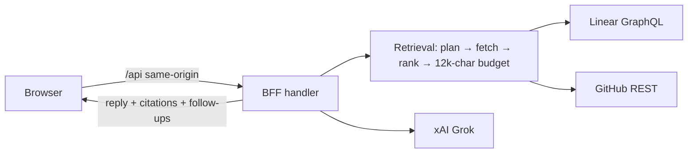

# Grok Insights (liquid-accounting-analytics)

Ask plain-English questions about **Linear tickets, GitHub pull requests and CI checks** and get a short answer from Grok with **a cited source for every claim**. The app is read-only: it never changes Linear or GitHub.

Built from [`docs/grok-insights-chat-spec.md`](docs/grok-insights-chat-spec.md) (MVP scope). This is a separate product from the in-app finance assistant in `liquid-accounting-core`.



## Quickstart

```bash
npm install
cp .env.example .env.local      # then set LIQUID_BFF_DEMO_TOKEN (≥16 chars)
npm run dev:all                 # UI http://localhost:5173 · API 127.0.0.1:4200
```

With no keys it runs in **sample mode**: realistic LIQ-24 demo data and canned answers, clearly badged "Sample data". Add keys to `.env.local` to go live:

| Variable | Needed for | Notes |
| --- | --- | --- |
| `XAI_API_KEY` | Grok answers | Without it: sample answers or a plain source list |
| `XAI_MODEL` | – | Default `grok-4-fast-non-reasoning` |
| `LINEAR_API_KEY` | Live tickets | Personal or service key, read access; team key defaults to `LIQ` |
| `GITHUB_TOKEN` | Live PRs + checks | Fine-grained PAT, read-only: Contents, Pull requests, Checks |
| `GITHUB_REPOS` | – | Defaults to Core + Reporting |
| `LIQUID_BFF_DEMO_TOKEN` | Local dev auth | Injected by the Vite proxy; never in the bundle |
| `LIQUID_INSIGHTS_ACCESS_CODE` / `LIQUID_SESSION_SECRET` | **Hosted auth** | Required on Vercel, or every API route returns 503 |

The full list is in [`.env.example`](.env.example). If a key is set but that service fails, the answer marks it "unavailable" rather than quietly switching to sample data.

## Scripts

| Script | What it does |
| --- | --- |
| `npm run dev:all` | UI + API with hot reload |
| `npm run test` / `test:coverage` | Vitest: server unit and contract tests (node) + React tests (jsdom); coverage must stay ≥ 80% |
| `npm run test:e2e` | Playwright on desktop and mobile, sample mode on ports 5183/4210 |
| `npm run lint` / `typecheck` / `build` | ESLint · `tsc -b` · production build |

## Deploying (Vercel)

`vercel.json` serves the Vite build as a static site and sends every `/api/*` request to one function (`api/index.ts`). That function wraps the **same handler** as the local server (`server/app.ts`), so the auth, limits and validation rules are identical in both places.

**Hosted auth:** viewers enter a shared access code once, and the server sets a signed `__Host-` session cookie (HttpOnly, Secure, SameSite=Strict, 12 hours). The demo bearer token is **refused** in production unless you explicitly set `LIQUID_ALLOW_DEMO_TOKEN=true`.

Required Vercel env vars (Production and Preview): `LIQUID_INSIGHTS_ACCESS_CODE`, `LIQUID_SESSION_SECRET`, plus whichever connector keys you want live.

## Security posture

- API keys stay on the server. There is no `VITE_`-prefixed secret, and the browser only talks to its own origin.
- **Fails closed.** A request is refused if it comes from another origin (403), lacks a valid token or cookie (401), or reaches a deployment with no auth configured (503).
- **Rate limits** per IP: 180 requests/min overall, 20/min for chat, 10/min for access-code attempts. These are counted per server instance, so treat them as abuse damping rather than a hard quota.
- **Input limits:** request bodies up to 64 KB, messages of 2 to 2,000 characters, and the last 6 turns of history.
- Ticket and PR text is redacted (emails and anything shaped like a credential) before it reaches Grok. Grok is told to treat retrieved text as data, not instructions.
- **Citations are enforced server-side.** Any ID Grok invents that wasn't retrieved is removed from both the source list and the answer text.
- **Logs** are structured and allowlisted. They record message *length*, never message text, keys or comment bodies.

More detail: [`docs/ARCHITECTURE.md`](docs/ARCHITECTURE.md) · [`docs/CONNECTORS.md`](docs/CONNECTORS.md).
