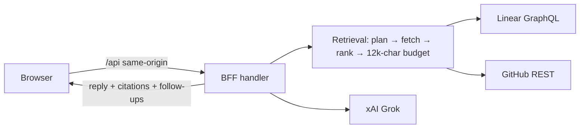

# Liquid Insights (liquid-accounting-analytics)

Ask plain-English questions about **Linear tickets, GitHub pull requests and CI checks** and get a short answer from Grok with **a cited source for every claim**. It never changes GitHub. The one change it can make is **moving a Linear ticket to In Progress**, and only after you click Confirm (see [Ticket moves](#ticket-moves)).

Built from [`docs/grok-insights-chat-spec.md`](docs/grok-insights-chat-spec.md) (MVP scope). This is a separate product from the in-app finance assistant in `liquid-accounting-core`.



## Quickstart

```bash
npm install
cp .env.example .env.local      # then set LIQUID_BFF_DEMO_TOKEN (≥16 chars)
npm run dev:all                 # UI http://localhost:5173 · API 127.0.0.1:4200
```

With no keys it runs in **sample mode**: realistic LIQ-24 demo data and canned answers, clearly badged "Sample data". Add keys to `.env.local` to go live:

| Variable | Needed for | Notes |
| --- | --- | --- |
| `XAI_API_KEY` | Grok answers | Without it: sample answers or a plain source list |
| `XAI_MODEL` | – | Default `grok-4-fast-non-reasoning` |
| `LINEAR_API_KEY` | Live tickets | Personal or service key, read access; team key defaults to `LIQ` |
| `GITHUB_TOKEN` | Live PRs + checks | Fine-grained PAT, read-only: Contents, Pull requests, Checks |
| `GITHUB_REPOS` | – | Defaults to Core + Reporting |
| `LIQUID_BFF_DEMO_TOKEN` | Local dev auth | Injected by the Vite proxy; never in the bundle |
| `LIQUID_INSIGHTS_ACCESS_CODE` / `LIQUID_SESSION_SECRET` | **Hosted auth** | Required on Vercel, or every API route returns 503 |
| `POSTHOG_PERSONAL_API_KEY` / `POSTHOG_PROJECT_ID` / `POSTHOG_HOST` | Live product analytics | Read-only key; host must be us/eu/app.posthog.com |
| `POSTHOG_PROJECT_TOKEN` | Insights question log | Public `phc_` token; categories only, never question text |
| `LINEAR_ACTIONS_API_KEY` | Ticket moves | A **separate** Linear key with write access; without it the app stays read-only |

The full list is in [`.env.example`](.env.example). If a key is set but that service fails, the answer marks it "unavailable" rather than quietly switching to sample data.

## Scripts

| Script | What it does |
| --- | --- |
| `npm run dev:all` | UI + API with hot reload |
| `npm run test` / `test:coverage` | Vitest: server unit and contract tests (node) + React tests (jsdom); coverage must stay ≥ 80% |
| `npm run test:e2e` | Playwright on desktop and mobile, sample mode on ports 5183/4210 |
| `npm run lint` / `typecheck` / `build` | ESLint · `tsc -b` · production build |

## Deploying (Vercel)

`vercel.json` serves the Vite build as a static site and sends every `/api/*` request to one function (`api/index.ts`). That function wraps the **same handler** as the local server (`server/app.ts`), so the auth, limits and validation rules are identical in both places.

**Hosted auth:** viewers enter a shared access code once, and the server sets a signed `__Host-` session cookie (HttpOnly, Secure, SameSite=Strict, 12 hours). The demo bearer token is **refused** in production unless you explicitly set `LIQUID_ALLOW_DEMO_TOKEN=true`.

Required Vercel env vars (Production and Preview): `LIQUID_INSIGHTS_ACCESS_CODE`, `LIQUID_SESSION_SECRET`, plus whichever connector keys you want live.

## Charts

Some questions come back with a chart above the sources:

| Ask | Chart |
| --- | --- |
| "How many PRs merged per day this week, Core vs Reporting?" | PRs merged per day, by repo |
| "Show our Linear tickets by status" / "Bugs in Todo vs Done" | Tickets by status, bugs stacked on other tickets |
| "Are we closing bugs faster than we open them?" | Opened vs closed per week (last 4+ weeks) |
| "How often has assistant-unit failed over the last 2 weeks?" | Passed vs failed per day, for that check or for all CI runs |
| "How has product usage changed over the last 2 weeks?" | Product activity per day, Core vs Reporting (PostHog) |
| "Is the BFF disconnecting? Show connection checks per day" | BFF connected vs not per day (PostHog) |

- **The server computes every chart number** from Linear and GitHub data (`server/charts.ts`); Grok only writes the prose around it and is given the same numbers.
- **Days follow `LIQUID_TIMEZONE`** (default Australia/Sydney). Windows up to 14 days are shown per day; longer ones per week.
- **Colours are validated for colour blindness** with the dataviz checker: blue/orange for comparisons, green/red reserved for passed/failed.
- **Each chart has a legend, a hover tooltip and a "Show data" table,** so no information is conveyed by colour alone.
- **Product activity and BFF health charts come from PostHog,** using fixed aggregate queries over the same event and property allowlist the apps send (no raw events, no personal data, no user text in queries). AI Assistant usage **isn't tracked** in PostHog yet, and answers say so.

## "What have people been asking?"

Every answered question is logged to PostHog as one `insights_question` event holding **categories only**: topic (ticket status, CI health, merged PRs, problems, product usage, ticket moves…), answer style, charts shown, sources used, answer type (Grok, sample, source list, ticket move), outcome (answered, fell back, error), speed, and an anonymous hash of the session. **The question text, ticket ids and anything typed are never recorded** (a test enforces this).

Ask Insights "What have people been asking this week?", "How are people using Insights?" or "What are the most common questions?" to get an overview plus two charts: questions by topic, and questions per day (answered vs fell back).

- Writing uses `POSTHOG_PROJECT_TOKEN` (the public `phc_` token); reading uses the personal key.
- Because the token is public, look-alike events are possible, so only known topics, answer types and outcomes are counted.
- E2E and CI blank these keys so test runs never pollute the log.

## Ticket moves

Ask "Move LIQ-17 to In Progress" (or "Start LIQ-17"):

1. **Detected by rules, not by Grok**, so the model can never decide to act on its own.
2. The answer shows a **confirm card** (ticket, from → to). Nothing changes yet.
3. **Confirm** posts a signed, 5-minute token tied to that exact ticket and state. The server re-checks the ticket's team and current state, moves it with the write key, and adds an **audit comment** to the ticket. A replayed token is a no-op.
4. If the `liquid-workflow` Linear webhook is connected, moving to In Progress starts the Cursor SDK workflow (plan → eval → human approval before any PR).

It is limited to `LIQUID_ACTIONS_ALLOWED_STATES` (default: In Progress), to the configured Linear team, and to 10 confirmations per minute per IP. Anyone with the access code can move tickets, so share the code accordingly.

## Security posture

- API keys stay on the server. There is no `VITE_`-prefixed secret, and the browser only talks to its own origin.
- **Fails closed.** A request is refused if it comes from another origin (403), lacks a valid token or cookie (401), or reaches a deployment with no auth configured (503).
- **Rate limits** per IP: 180 requests/min overall, 20/min for chat, 10/min for access-code attempts. These are counted per server instance, so treat them as abuse damping rather than a hard quota.
- **Input limits:** request bodies up to 64 KB, messages of 2 to 2,000 characters, and the last 6 turns of history.
- Ticket and PR text is redacted (emails and anything shaped like a credential) before it reaches Grok. Grok is told to treat retrieved text as data, not instructions.
- **Citations are enforced server-side.** Any ID Grok invents that wasn't retrieved is removed from both the source list and the answer text.
- **Logs** are structured and allowlisted. They record message *length*, never message text, keys or comment bodies.

More detail: [`docs/ARCHITECTURE.md`](docs/ARCHITECTURE.md) · [`docs/CONNECTORS.md`](docs/CONNECTORS.md).
