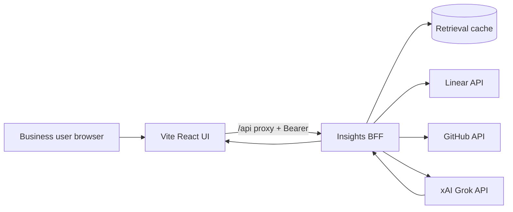

# Grok Insights Chat — Product & Engineering Spec

**Author:** Tom Glover (Liquid Accounting demo program)  
**Audience:** Claude Code / new engineering session (no prior Project chat required)  
**Status:** Handoff spec for a **new separate GitHub repo**  
**Last updated:** September 2026

---

## Document purpose

This spec defines **Grok Insights Chat**: a standalone web product where finance ops leaders, engineering managers, and support-adjacent roles ask natural-language questions about **work tracking (Linear), delivery activity (GitHub), and optional observability summaries (PostHog, Sentry)**. Answers are **synthesized by Grok (xAI)** over **retrieved, bounded context** — not raw API dumps pasted into the UI.

The experience is inspired by **Slack Help Center** and **Salesforce Agentforce** landing patterns: centered hero (“Ask anything”), suggested prompt pills, org/workspace switcher, clean discovery — **not** the Liquid Accounting right-rail assistant (that remains a separate in-app surface in `liquid-accounting-core`).

**Out of scope for this repo:** Cursor SDK workflow (`liquid-workflow`), merging Core/Reporting repos, or write actions against Linear/GitHub.

---

## 1. Vision & users

### Vision

Give business-adjacent stakeholders a **single conversational surface** to understand “what is happening” across engineering delivery: open defects, parity tickets, PR/CI health, and trend questions (“Are assistant-related failures increasing?”) without opening five tools.

Grok’s job is **reasoning and narrative synthesis** with **explicit citations** back to Linear issues, commits, PRs, and check runs. The BFF’s job is **governed retrieval**, token budgeting, caching, and auth — mirroring Liquid’s fail-closed BFF patterns from the accounting demo.

### Primary users

| Persona | Goals | Typical questions |
| --- | --- | --- |
| **Finance ops / product ops** | Understand customer-impacting defects and fix progress | “What’s blocking LIQ-24?” “Which tickets mention the AI assistant?” |
| **Engineering lead** | Repo activity, CI failures, cross-repo parity | “What merged on Reporting last week?” “Any failing `assistant-unit` on main?” |
| **Support / success (read-only)** | Status without Jira/Linear fluency | “Is the reporting app assistant fixed yet?” |

### Non-goals (MVP)

- Developers-only CLI or MCP-first UX (web chat is primary).
- Autonomous agents that open PRs, change Linear state, or merge code (**forbidden in all phases**).
- Live financial ledger Q&A (optional Liquid Coffee Co. branding only; data is engineering/ops).

### Success metrics (product)

- Time-to-answer for curated demo questions &lt; 15s P95 (with cache warm).
- Every answer includes ≥1 **source citation** when retrieval returned data.
- Zero PII/financial amounts in server logs or analytics (engineering metadata only).

---

## 2. UX reference

### Layout (desktop)

```
┌─────────────────────────────────────────────────────────────┐
│  [Logo]  Grok Insights          [Org ▼ Liquid Coffee Co.]   │
├─────────────────────────────────────────────────────────────┤
│                                                             │
│              What do you want to know?                      │
│         ┌─────────────────────────────────────┐           │
│         │  Ask anything about tickets, bugs,    │           │
│         │  PRs, and delivery trends…            │           │
│         └─────────────────────────────────────┘           │
│                      [ Ask → ]                              │
│                                                             │
│   ( pill ) Open LIQ-24 status                               │
│   ( pill ) PRs merged this week on Reporting              │
│   ( pill ) CI failures on assistant-unit                  │
│   ( pill ) Linear bugs in Todo vs Done                      │
│                                                             │
│   ── Recent threads (optional MVP+) ──                      │
│   • “What’s the AI assistant seam?” · 2h ago                │
└─────────────────────────────────────────────────────────────┘
```

After send: **conversation thread** below hero (user bubble + assistant card). Assistant card includes:

- Markdown answer body
- **Sources** panel (chips: `Linear LIQ-24`, `GitHub PR #10`, `Check assistant-unit`)
- **Suggested follow-ups** (3 pills, Grok-generated)
- Optional “How this was built” accordion (retrieval summary: which connectors ran, time range — no raw JSON)

### Visual language

- Reuse Liquid brand tokens where practical: primary `#ff292e`, neutrals `#374151`, **Space Grotesk**, Lucide icons — aligns with `liquid-accounting-core` / `liquid-accounting-reporting` without importing those repos.
- Hero centered max-width ~640px; thread max-width ~720px.
- Mobile: single column; org switcher collapses to icon; pills horizontal scroll.

### Interaction details

| Element | Behavior |
| --- | --- |
| Hero composer | Enter or primary button sends; 2–2000 chars |
| Pills | Prefill composer and send (or prefill only — implement prefill+send for demo speed) |
| Org switcher | Switches **connector scope** (Linear team, GitHub org/repos list); MVP may ship single org |
| Thread history | **MVP:** session-only in memory; **v2:** server-backed threads per user |
| Loading | Skeleton + “Searching Linear and GitHub…” staged status |
| Errors | Fail-closed messages; no partial secrets in UI |

### Reference surfaces (do not clone literally)

- Slack Help Center: centered search, category pills, calm whitespace.
- Agentforce landing: suggested prompts, trust-oriented copy.
- Liquid in-app assistant (`AiAssistant.tsx`): borrow **markdown + related questions + rationale accordion** patterns, not the right-rail chrome.

---

## 3. Data sources & connectors

All connectors run **server-side only**. API keys never reach the browser.

### 3.1 Linear (required MVP)

- **Auth:** `LINEAR_API_KEY` (personal or service account with read scope).
- **Team:** Liquid demo team `liquid-accounting` (issues prefixed `LIQ-*`).
- **Fetch patterns:**
  - Issue by identifier: `LIQ-24`
  - Search/filter: state (`Todo`, `In Progress`, `In Review`, `Done`), label, text query
  - Issue history/comments (bounded: last N comments, truncated bodies)
- **Hero ticket context (demo narrative):** LIQ-24 — AI Assistant works on Core, broken/missing BFF chat on Reporting; supporting LIQ-16 (Help centre), LIQ-17 (Notifications), LIQ-15/LIQ-9 (deep-link parity).

### 3.2 GitHub (required MVP)

- **Auth:** `GITHUB_TOKEN` (fine-grained or classic PAT; read-only: contents, pull requests, checks, commits).
- **Repos (Liquid demo):**
  - `gloverthomas/liquid-accounting-core`
  - `gloverthomas/liquid-accounting-reporting`
  - Optional read for context: `gloverthomas/liquid-workflow` (eval gates, LIQ prompts — **not** required for MVP UI)
- **Fetch patterns:**
  - Recent merged PRs (default 14 days, max 30)
  - Open PRs for hero issues (search PR body/title for `LIQ-24`)
  - Commit activity (summary counts, authors — no full diffs in v1)
  - Check runs on `main`: `build`, `assistant-unit`, `smoke`, `parity-proof` (Core); `build`, `assistant-unit`, `help-proof` (Reporting)
- **Boundaries:** No file content fetch &gt; 50 KB aggregate per request; no binary assets.

### 3.3 PostHog (optional MVP / v2)

- **Use:** Pre-aggregated **insight summaries** or allowlisted event counts — not raw event export.
- Align with Liquid apps: allowlisted events only (`product_navigation`, `bff_status`, `$pageview`, etc.); **never** send financial amounts or org names from chat logs to PostHog.
- **MVP:** Static JSON fixture mimicking “assistant adoption flat, navigation to AI Assistant up” unless `POSTHOG_PERSONAL_API_KEY` + project id configured.

### 3.4 Sentry (optional v2)

- **Use:** Issue count / trend summary for known demo projects (cross-app URL drift warnings narrative from talk track).
- **MVP:** Omit or fixture “Reporting assistant errors elevated” with link template only.

### 3.5 Repo file / code search (optional v2)

- Bounded `grep`-style via GitHub Search API (path filters: `server/server.mjs`, `src/components/AiAssistant.tsx`).
- Hard cap: 5 files, 40 lines context each, redact secrets patterns.

### Connector registry (implementation)

Define a typed registry in the BFF:

```ts
type ConnectorId = "linear" | "github" | "posthog" | "sentry" | "github_search";

interface ConnectorResult {
  connector: ConnectorId;
  fetchedAt: string; // ISO
  summaryForModel: string; // pre-truncated text
  citations: Citation[];
}
```

---

## 4. Retrieval architecture

### 4.1 Pipeline (per chat turn)

1. **Intent routing (lightweight):** Rules + optional small classifier (no extra LLM call in MVP): map question → connector set + time window.
2. **Parallel fetch:** Linear + GitHub (always for MVP); optional fixtures merged if keys missing.
3. **Normalize:** Convert API JSON to **stable text blocks** with IDs (`[linear:LIQ-24]`, `[github:PR:gloverthomas/liquid-accounting-reporting#10]`).
4. **Rank & trim:** Keep top-K items by recency and keyword overlap with user message.
5. **Token budget:** Target **≤ 12k characters** (~3k tokens) retrieval context before Grok; hard truncate with “…” and preserve citation IDs.
6. **Grok call:** System prompt requires synthesis + citations array referencing IDs from step 3.
7. **Response validation:** JSON schema check; if invalid, one repair attempt; else fixture fallback.

### 4.2 Caching

| Layer | Key | TTL |
| --- | --- | --- |
| Linear issue | `linear:issue:LIQ-24` | 60s |
| GitHub PR list | `github:prs:reporting:14d` | 120s |
| Check runs on SHA | `github:checks:{repo}:{ref}` | 180s |
| Grok answer | **Do not cache** full answers (fresh synthesis); cache retrieval only |

Use in-memory LRU for MVP; Redis optional v2.

### 4.3 Citation contract

Every assistant message returned to the client:

```json
{
  "reply": "markdown string",
  "citations": [
    { "id": "linear:LIQ-24", "title": "LIQ-24 AI Assistant parity", "url": "https://linear.app/..." },
    { "id": "github:PR:...", "title": "Wire assistant chat on Reporting BFF", "url": "https://github.com/..." }
  ],
  "relatedQuestions": ["...", "...", "..."],
  "retrievalMeta": { "connectors": ["linear", "github"], "truncated": false }
}
```

Grok must **not** invent issue numbers or PR URLs absent from retrieval context; if context empty, say so and suggest pills.

### 4.4 Question → retrieval cheat sheet

| User intent | Connectors | Notes |
| --- | --- | --- |
| Ticket status | Linear | Single issue or state filter |
| “What merged recently?” | GitHub | Merged PRs, both repos |
| CI health | GitHub Checks | Latest commit on `main` |
| Trends | GitHub + optional PostHog fixture | Count merges/week; narrate limitation |
| Cross-repo parity | Linear LIQ-* + GitHub parity-proof mentions | Tie to demo narrative |

---

## 5. Grok integration

### 5.1 API

- **Endpoint:** `https://api.x.ai/v1/chat/completions`
- **Env:**
  - `XAI_API_KEY` (required for live Grok; never commit)
  - `XAI_MODEL` default `grok-4-fast-non-reasoning` (match Core BFF); allow override e.g. `grok-4-fast-reasoning` for harder trend questions in v2
- **Timeout:** 8s (match `liquid-accounting-core/server/server.mjs`)
- **Temperature:** 0.2–0.3
- **Max tokens:** 900 (insights answers longer than finance chips)

### 5.2 Fixture fallback (demo without keys)

When `XAI_API_KEY` unset or Grok errors:

- Load **`fixtures/responses/*.json`** keyed by intent (LIQ-24 status, recent PRs, CI summary).
- Set `provider: "fixture"` in response (mirror Core assistant `provider: "fixture" | "grok:..."`).

### 5.3 System prompt rules (summary)

Include in `server/prompts/grok-insights-system.txt`:

1. You are **Grok Insights**, a read-only engineering intelligence assistant for Liquid’s demo org.
2. Use **only** facts in the RETRIEVAL block; cite using provided `[id]` tokens; map to client citations.
3. **Never** claim merge/deploy actions were taken; humans merge (Liquid workflow story).
4. **No PII**, no customer financial amounts, no real bank data.
5. Prefer concise markdown: bullets, bold labels, short paragraphs.
6. Output **only JSON** matching response schema (no markdown fences) — same discipline as Core `callGrok`.
7. If asked to change Linear/GitHub, refuse and explain read-only policy.

### 5.4 Logging

Structured JSON logs allowed fields:

- `event`, `requestId`, `provider`, `connectors`, `latencyMs`, `grok_error` (truncated)

**Forbidden in logs:** user message full text in production (hash or length only); API keys; Linear comment bodies with emails; PR diff content.

---

## 6. API design (BFF)

### 6.1 Process model

- **Node 20+** HTTP server (mirror Liquid: `server/server.mjs` or TypeScript `server/index.ts`).
- Bind **loopback** in dev; production behind Vercel/Cloudflare with same routes.
- Vite dev proxy: `/api` → BFF, injects `Authorization: Bearer ${LIQUID_BFF_DEMO_TOKEN}` server-side (never in client bundle).

### 6.2 Auth (production-minded demo)

| Mode | Mechanism |
| --- | --- |
| Local/demo | `LIQUID_BFF_DEMO_TOKEN` (≥16 chars), Bearer header, timing-safe compare |
| Production path | Session cookie issued by auth provider **or** OAuth2 bearer; token rotation; same BFF validation layer |

Fail closed: 401 unauthorized, 403 origin not allowed, 429 rate limit (e.g. 60 req/min/IP for chat).

CORS: allowlist single app origin (`LIQUID_INSIGHTS_APP_ORIGIN`).

`NODE_ENV=production` requires explicit feature flags to enable demo token (prevent accidental prod demo token).

### 6.3 Endpoints

| Method | Path | Description |
| --- | --- | --- |
| GET | `/health` | `{ status, service, grok: "grok"|"fixture", connectors: {...} }` |
| GET | `/api/v1/organisation` | `{ id, name, role }` — default `Liquid Coffee Co.` for demo continuity |
| GET | `/api/v1/orgs` | List switcher entries (MVP: single org) |
| GET | `/api/v1/suggested-prompts` | Pill labels + optional prefilled queries |
| POST | `/api/v1/insights/chat` | Body: `{ message, history?, orgId? }` → assistant payload + citations |
| GET | `/api/v1/connectors/status` | Which integrations configured (boolean flags only) |

**Do not** expose raw Linear/GitHub proxy endpoints to the browser in MVP (single chat orchestration endpoint).

### 6.4 Request/response example

**POST `/api/v1/insights/chat`**

```json
{
  "message": "What's the status of LIQ-24 and are there PRs?",
  "history": [
    { "role": "user", "content": "..." },
    { "role": "assistant", "content": "..." }
  ],
  "orgId": "org_liquid_coffee"
}
```

Response 200:

```json
{
  "requestId": "uuid",
  "reply": "**LIQ-24** is …",
  "citations": [{ "id": "linear:LIQ-24", "title": "...", "url": "..." }],
  "relatedQuestions": ["...", "...", "..."],
  "provider": "grok:grok-4-fast-non-reasoning",
  "retrievalMeta": { "connectors": ["linear", "github"], "truncated": false }
}
```

---

## 7. Frontend stack recommendation

**Choose: Vite 7 + React 19 + TypeScript** (same stack as Liquid Core/Reporting).

| Factor | Vite + React | Next.js |
| --- | --- | --- |
| Brand/style reuse | Copy CSS variables and patterns directly from Liquid demo | Possible, more indirection |
| BFF alignment | Identical proxy + loopback BFF pattern already proven | App Router API routes overlap with separate BFF goal |
| Deploy | Static UI + small Node BFF (Vercel serverless optional) | Heavier for chat-only product |
| Claude Code velocity | Single `npm run dev` + `npm run api` | Extra routing conventions |

**UI libraries:** Lucide React; minimal dependency footprint; optional `@posthog/react` only if analytics added with same allowlist pattern as `src/analytics.ts` in Core.

**Testing:** Vitest + RTL for hero composer and citation panel; Playwright smoke for “ask LIQ-24 pill → see citation”.

---

## 8. Repo layout (new separate repo)

Suggested name: **`liquid-grok-insights`** (GitHub org/user: `gloverthomas` or customer org).

```text
liquid-grok-insights/
  README.md                 # Quickstart, env table, architecture diagram
  package.json
  .env.example
  .github/workflows/ci.yml  # unit + lint; no live XAI/Linear in CI
  vite.config.ts            # proxy /api → BFF
  index.html
  public/
  src/
    main.tsx
    App.tsx
    components/
      InsightsHero.tsx
      PromptPills.tsx
      OrgSwitcher.tsx
      ChatThread.tsx
      CitationList.tsx
      SourcesAccordion.tsx
    hooks/useInsightsChat.ts
    styles/
      liquid-tokens.css
    analytics.ts              # optional; fail-closed allowlist
  server/
    index.ts                  # or server.mjs
    auth.ts
    rateLimit.ts
    retrieval/
      router.ts
      linear.ts
      github.ts
      posthog.ts              # optional
      cache.ts
    grok/
      client.ts
      parseResponse.ts
    prompts/
      grok-insights-system.txt
    fixtures/
      linear-liq-24.json
      github-prs-reporting.json
      responses/liq-24-status.json
  tests/
    unit/
    contract/                 # connector mocks, golden retrieval snippets
  scripts/
    smoke-local.sh
    validate-env.ts
  docs/
    ARCHITECTURE.md
    CONNECTORS.md
```

### Scripts (`package.json`)

| Script | Purpose |
| --- | --- |
| `dev` | Vite UI |
| `api` | BFF on `127.0.0.1:4200` (pick unused port vs Core 4000) |
| `dev:all` | Concurrent UI + API |
| `test:unit` | Vitest |
| `test:e2e` | Playwright |
| `lint` | ESLint |
| `typecheck` | `tsc -b` |

### `.env.example` (minimum)

```bash
# App
LIQUID_INSIGHTS_APP_ORIGIN=http://localhost:5173
LIQUID_BFF_DEMO_TOKEN=local-demo-token-change-me-min-16-chars

# Grok
XAI_API_KEY=
XAI_MODEL=grok-4-fast-non-reasoning

# Connectors (optional — fixtures when empty)
LINEAR_API_KEY=
LINEAR_TEAM_ID=
GITHUB_TOKEN=
GITHUB_REPOS=gloverthomas/liquid-accounting-core,gloverthomas/liquid-accounting-reporting

# Optional analytics (allowlisted events only)
VITE_POSTHOG_PROJECT_TOKEN=
VITE_POSTHOG_HOST=https://us.i.posthog.com
```

---

## 9. MVP vs v2

### MVP (ship first)

- Centered hero chat UI + pills + org switcher (single org).
- BFF retrieval: **Linear + GitHub read-only**; fixture mode without keys.
- Grok synthesis with citations; fixture fallback.
- Session thread in UI (no persistence).
- Auth: demo bearer via Vite proxy injection.
- CI: unit tests + contract tests; mocked Grok; **no secrets in GitHub Actions**.

### v2 (explicit later)

- Trend dashboards (merges/week, ticket cycle time, check failure rate).
- Scheduled email/Slack digests (read-only summaries).
- Server-backed chat history per user.
- PostHog/Sentry live summaries (still no raw PII).
- GitHub code search connector.
- **Still forbidden:** Linear state changes, PR creation/merge, comment spam, deploy hooks.

---

## 10. Security, compliance, rate limits

### Principles (from Liquid BFF demo)

- **Fail closed:** missing token, wrong origin, or missing connector creds → safe errors; fixtures only when explicitly in demo mode.
- **Read-only tokens:** Linear/GitHub PATs scoped to minimum read permissions; rotate regularly.
- **No secrets in git:** `.env.local` only; CI uses mock servers.
- **Rate limits:** BFF IP sliding window (≥180/min per Liquid Core pattern for general traffic; stricter 20/min on `/insights/chat` recommended).
- **Request size:** Max body 64 KB; message ≤ 2000 chars; history ≤ 6 turns (match Core assistant sanitization).
- **Analytics:** If PostHog enabled, copy allowlist approach from Liquid Core `analytics.ts` — add events like `insights_chat_sent` with properties `{ app: "insights", connector_count: number }` only; **deny** free-form properties.
- **Headers:** `Cache-Control: no-store`, CSP on API responses, `X-Request-Id` on all JSON errors.

### Compliance narrative

Synthetic/demo data for Liquid Coffee Co.; not production MYOB customer data. Position as **internal engineering intelligence** tool; legal review before customer-facing deployment.

---

## 11. Example user questions & expected answer shape

### Example A — Hero ticket status

**Question:** “What’s going on with LIQ-24?”

**Retrieval:** Linear issue LIQ-24 (state, description); GitHub open/merged PRs mentioning LIQ-24.

**Expected answer (shape):**

- Opening sentence: state + one-line summary (assistant parity Core vs Reporting).
- Bullets: customer impact, root cause class (missing `POST /api/v1/assistant/chat` on Reporting BFF).
- **Sources:** `Linear LIQ-24`, any PR links.
- Follow-ups: “Show me CI checks on the Reporting PR”, “Which other LIQ tickets are parity-related?”

### Example B — Delivery activity

**Question:** “What merged on liquid-accounting-reporting in the last 7 days?”

**Expected:** List up to 5 PRs with title, merge date, author login; cite each PR URL; note if none.

### Example C — CI health

**Question:** “Is assistant-unit passing on Core main?”

**Expected:** Latest check conclusion on `main` for `assistant-unit`; cite check run or commit SHA; if unknown, say retrieval gap.

### Example D — Trend (MVP honest limitation)

**Question:** “Are AI assistant failures increasing?”

**Expected:** Combine Linear labels/states + optional PostHog fixture narrative; explicit confidence caveat; citations; do not fabricate percentages without data.

---

## 12. Claude Code kickoff prompt

Copy everything in the block below into a **new Claude Code session** after creating the empty repo.

```text
You are implementing **liquid-grok-insights** from the product spec pasted below (or from docs/grok-insights-chat-spec.md in repo if already copied).

Goal: Standalone Vite 7 + React 19 + TypeScript app with a Node BFF that:
1. Serves a Slack/Agentforce-style centered hero (“Ask anything”), prompt pills, org switcher, and chat thread with citations.
2. On POST /api/v1/insights/chat, runs retrieval (Linear + GitHub read-only, fixtures when keys missing), then calls xAI Grok (XAI_API_KEY) to synthesize an answer — NOT a raw API dump.
3. Mirrors Liquid Accounting BFF security: loopback BFF, LIQUID_BFF_DEMO_TOKEN bearer injected by Vite proxy, fail-closed CORS, rate limits, no secrets in client bundle, no PII/financial amounts in logs.

Implement MVP only (see spec section 9). Do not add write actions to Linear/GitHub. Do not depend on liquid-accounting-core as a git submodule; optional fixture data may reference LIQ-24 and gloverthomas repos.

Deliverables:
- Working npm run dev:all (UI + API)
- .env.example documented
- Vitest unit tests for chat hook and citation rendering
- Contract tests for retrieval with mocked Linear/GitHub
- GitHub Actions CI without live API keys (mock Grok)

Read the full spec sections 1–14 before coding. Match Liquid brand tokens (#ff292e, Space Grotesk). Default org name: Liquid Coffee Co.

When unsure, prefer fail-closed behavior and fixture fallback like liquid-accounting-core/server/server.mjs assistant chat.
```

---

## 13. Testing strategy

### Unit (Vitest + RTL)

- `InsightsHero` sends message; pills trigger queries.
- `CitationList` renders links from API payload.
- `parseGrokResponse` handles JSON, markdown fence strip, malformed Grok output.

### Contract tests (retrieval)

- Mock Linear GraphQL and GitHub REST with **nock** or MSW.
- Golden files: given user query “LIQ-24”, assert retrieval bundle contains expected citation IDs and respects char budget cap.

### Grok mocking

- Inject `GrokClient` interface; CI uses fixture implementing `complete()` returning canned JSON.
- Never read `XAI_API_KEY` in CI workflows; fail if secret detected in test logs.

### E2E (Playwright)

- Start BFF with fixtures only (`XAI_API_KEY` unset).
- Click pill “Open LIQ-24 status” → assistant shows citation chip containing `LIQ-24`.

### Manual demo checklist

- [ ] With keys: live Linear + GitHub + Grok answer with citations
- [ ] Without keys: fixture answer identical structure, `provider: fixture`
- [ ] 401 when proxy token missing
- [ ] Mobile viewport: hero usable

---

## 14. Relationship to Liquid Accounting demo

| Liquid artifact | Relationship to Grok Insights Chat |
| --- | --- |
| `liquid-accounting-core` / `reporting` | **Optional narrative alignment** (LIQ-24, org name, brand); no code merge required |
| In-app AI Assistant (Grok over **finance** demo books) | **Different product surface** — Insights Chat targets **tickets/repos/CI**, not P&L |
| `liquid-workflow` | **Out of scope** — SDK/eval/cloud agents remain separate; Insights may *mention* workflow URLs in answers when retrieved from GitHub docs |
| PostHog / Sentry in Liquid apps | Same **allowlist / fail-closed** philosophy; Insights does not replace PostHog dashboards |
| Production URLs (reference) | Core `https://liquid-accounting.world`, Reporting `https://reporting.liquid-accounting.world`, Workflow `https://workflow.liquid-accounting.world` |

**Optional integration (nice for demos):**

- Link from Liquid Core top bar “Insights” external link → hosted Grok Insights Chat (new tab).
- Shared synthetic org id `org_liquid_coffee` in `/api/v1/organisation` for consistent switcher label.

**Explicit non-requirement:** Do not fix Reporting BFF assistant or merge repos as part of Insights Chat work.

---

## Appendix A — Liquid demo context (mined references)

For implementers without access to the Cursor Project store:

- **Four-repo map:** Core, Reporting, Workflow, Presentation — see GitHub `gloverthomas/liquid-accounting-*`.
- **LIQ-24:** Primary hero defect — AI Assistant rail ported to Reporting; `POST /api/v1/assistant/chat` missing on Reporting BFF (`server/server.mjs`).
- **CI checks:** Core `build`, `assistant-unit`, `smoke`, `parity-proof`; Reporting `build`, `assistant-unit`, `help-proof`.
- **BFF demo token:** `LIQUID_BFF_DEMO_TOKEN`, loopback-only BFF, Vite proxy injection.
- **Grok in Core:** `XAI_API_KEY`, `XAI_MODEL` default `grok-4-fast-non-reasoning`, JSON response shape with `reply`, `rationale`, `relatedQuestions`.
- **Workflow state machine (context only):** In Progress → plan/eval → Approve → In Review → PRs → humans merge; eval is deterministic in `liquid-workflow`, not an MCP.

---

## Appendix B — Architecture diagram



---

*End of spec — hand off to Claude Code in new repo `liquid-grok-insights`.*
